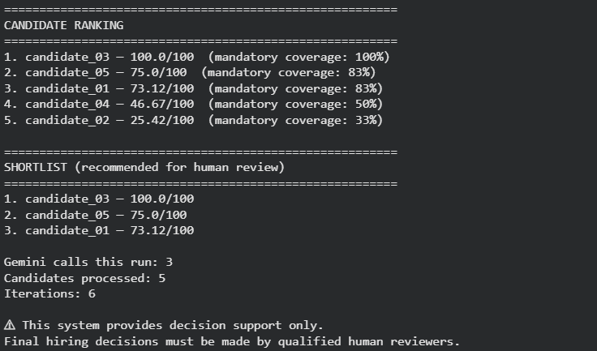

# 🤖 Agentic Recruiting Agent

Project 4 of 4 in my Agentic AI portfolio:

```
01 — Research Agent
02 — Coding Agent
03 — Sales Agent
04 — Recruiting Agent   ← this repo
```

Runs entirely in Google Colab on a free-tier Gemini API key. No paid APIs,
no LangChain/LangGraph/CrewAI/AutoGen, no Docker, no backend server.

## Overview

Give it a job description and a folder of resumes, and it produces a
ranked, evidence-backed shortlist a recruiter can actually review —
not a single opaque number.

## Problem

Most "AI resume screeners" are `resume → LLM → score`. That's fast to
build and mostly useless: the score isn't reproducible, there's no
evidence trail, and it's trivial for the model to (even unintentionally)
lean on things it shouldn't, like a name or a school.

## Solution

This project separates the two things an LLM and a scoring system are
each actually good at:

- **Gemini** reads unstructured text (job descriptions, resumes) and
  turns it into structured data, and matches that data semantically
  against requirements.
- **Plain Python** does every score, every rank, every threshold check.
  Same inputs, same output, every time.

## Why This Is Agentic

This is not a single prompt. It's a small agent with:

- **explicit state** (`RecruitingState`) that accumulates through the run
- **a dynamically generated plan** based on the parsed job requirements
- **a bounded action loop** (`MAX_ITERATIONS = 4`) stepping through a
  fixed set of named actions, not an open-ended "let the model decide
  everything" loop
- **tools** it calls for specific sub-tasks (job analysis, profile
  extraction, requirement matching, report synthesis)
- **a self-check step** that verifies every mandatory requirement was
  evaluated, every match has evidence, every score is in bounds, and no
  prohibited field leaked into a profile — *before* it's willing to rank
  anyone
- **iterative structure**: state gets inspected and validated, not just
  written once and returned

## Architecture

```
                    JOB DESCRIPTION
                          │
                          ▼
              ┌───────────────────────┐
              │ REQUIREMENT ANALYZER  │  (Gemini call 1)
              └───────────┬───────────┘
                          ▼
              ┌───────────────────────┐
              │ RECRUITING PLANNER    │  (Python, no LLM)
              └───────────┬───────────┘
                          ▼
              ┌───────────────────────┐
              │ RESUME INGESTION      │  (Python: .txt/.md/.pdf)
              └───────────┬───────────┘
                          ▼
              ┌───────────────────────┐
              │ CANDIDATE PROFILE     │  (Gemini call 2, batched)
              │ EXTRACTION            │
              └───────────┬───────────┘
                          ▼
              ┌───────────────────────┐
              │ REQUIREMENT MATCHING  │  (Gemini call 3, batched)
              │ + GAP ANALYSIS        │
              └───────────┬───────────┘
                          ▼
              ┌───────────────────────┐
              │ EXPLAINABLE SCORING   │  (Python, deterministic)
              └───────────┬───────────┘
                          ▼
              ┌───────────────────────┐
              │ QUALITY / EVIDENCE    │  (Python, self-check)
              │ CHECK                 │
              └───────────┬───────────┘
                          ▼
              ┌───────────────────────┐
              │ RANK + SHORTLIST      │  (Python, deterministic)
              └───────────┬───────────┘
                          ▼
              ┌───────────────────────┐
              │ REPORT SYNTHESIS      │  (Gemini call 4 — prose only)
              └───────────┬───────────┘
                          ▼
                    FINAL REPORT
```

## Agent Workflow

1. Analyze the job description into mandatory / preferred requirements
2. Build an evaluation plan from those requirements
3. Parse every resume in `data/resumes/`
4. Extract a structured profile per candidate (skills, experience,
   projects, education, certifications — nothing else)
5. Match every candidate against every requirement, with evidence, and
   label each as `MATCH` / `PARTIAL_MATCH` / `NO_EVIDENCE`
6. Score deterministically in Python using configurable weights
7. Run a quality check on the evaluation before trusting it
8. Rank candidates and build a shortlist that also clears a minimum
   mandatory-coverage bar
9. Generate a Markdown + JSON report

### Job Requirement Extraction

One Gemini call turns the raw job description into:

```json
{
  "role": "AI Engineer",
  "mandatory_skills": ["Python", "FastAPI", "REST APIs", "..."],
  "preferred_skills": ["Docker", "AWS", "..."],
  "minimum_experience_years": 2,
  "responsibilities": ["Build AI applications", "..."]
}
```

### Resume Parsing

`parser.py` loads `.txt`, `.md`, and `.pdf` resumes. PDF text is pulled
with `pypdf`. A resume that fails to parse (e.g. a scanned PDF with no
text layer) is skipped with a warning — it does not crash the run.

### Candidate Matching

Every requirement gets one of three labels, never "does not have":

- `MATCH` — clearly evidenced in the resume
- `PARTIAL_MATCH` — related/adjacent experience
- `NO_EVIDENCE` — not mentioned (absence of evidence ≠ evidence of absence)

### Gap Analysis

Gaps are phrased as "not evidenced in the provided resume", not as a
deficiency claim about the candidate.

### Explainable Scoring

Scoring weights live in `config.py` and must sum to 1.0:

```python
SCORING_WEIGHTS = {
    "mandatory_skills": 0.50,
    "preferred_skills": 0.15,
    "experience": 0.20,
    "projects": 0.10,
    "evidence": 0.05,
}
```

Each component is computed in `scoring.py` and clamped so it can never
exceed its own weight's share of 100 — see `test_scoring.py` for the
bounds checks.

### Evidence Validation

Before ranking, the agent checks that every mandatory requirement was
evaluated for every candidate, every `MATCH`/`PARTIAL_MATCH` has evidence
text attached, every score is within `[0, 100]`, and no prohibited field
made it into a candidate profile.

### Candidate Ranking

Deterministic sort by score, tie-broken by mandatory coverage. The
report never says a candidate "will succeed" — only
**"recommended for human review."**

### Human-in-the-Loop

Every report ends with:

```
This system provides decision support only.
Final hiring decisions must be made by qualified human reviewers.
```

## Project Structure

```
04-recruiting-agent/
├── README.md
├── recruiting_agent.py     # state, plan, agent loop, report builder
├── tools.py                # Gemini-backed extraction/matching + privacy filter
├── llm.py                  # Gemini wrapper (retry, JSON parsing)
├── config.py                # weights, thresholds, model, all tunables
├── scoring.py               # deterministic scoring/ranking/shortlist (no LLM)
├── parser.py                 # .txt/.md/.pdf resume loading (no LLM)
├── requirements.txt
├── .env.example
├── data/
│   ├── job_description.txt
│   └── resumes/candidate_01.txt ... candidate_05.txt   (fictional)
├── outputs/                  # candidate_rankings.json, recruiting_report.md
├── tests/
│   ├── test_scoring.py       # no API key needed
│   └── test_parser.py        # no API key needed
└── notebooks/
    └── Agentic_Recruiting_Agent_Colab.ipynb
```

## Tech Stack

- Python 3
- `google-genai` (Gemini free tier)
- `pypdf` for PDF text extraction
- Google Colab (Secrets, file upload, ZIP download)
- No LangChain / LangGraph / CrewAI / AutoGen — the agent loop is plain
  Python so it's easy to read end to end

## Google Colab Setup

1. Open `notebooks/Agentic_Recruiting_Agent_Colab.ipynb` in Colab.
2. Run the install cell.
3. Add your Gemini key as a Colab secret (see below).
4. Run the cells top to bottom.

## Gemini API Setup

1. Get a free-tier key from [Google AI Studio](https://aistudio.google.com/apikey).
2. In Colab: click the 🔑 icon in the left sidebar → **Secrets**.
3. Add a secret named `GEMINI_API_KEY` with your key as the value.
4. Toggle "Notebook access" on for this notebook.
5. The notebook reads it with:
   ```python
   from google.colab import userdata
   GEMINI_API_KEY = userdata.get("GEMINI_API_KEY")
   ```
   The key is never printed or hard-coded anywhere in this repo.

## Running the Demo

Just run the notebook cells in order. It uses the bundled synthetic job
description and five synthetic resumes. To use your own data:

- Replace `data/job_description.txt`, or paste a new job description
  into the notebook's config cell.
- Upload your own `.txt` / `.md` / `.pdf` resumes into `data/resumes/`
  (or Colab's file upload widget) and re-run.

## Example Output

```
========================================================
🤖 AGENTIC RECRUITING AGENT
========================================================

🧠 Step 1 — Analyzing job requirements
✓ 6 mandatory requirements
✓ 4 preferred requirements

📄 Step 3 — Parsing resumes
✓ 5 resumes loaded

🏆 Step 8 — Ranking candidates and generating report
✓ Report generated

========================================================
SHORTLIST
========================================================
1. candidate_03 — 91/100
2. candidate_01 — 78/100
3. candidate_05 — 74/100

Gemini calls: 4
Candidates processed: 5
Iterations: 4

⚠ This system provides decision support only.
Final hiring decisions must be made by qualified human reviewers.
```
## Screenshot of the output



## Free-Tier Optimization

This whole design exists to fit a rate-limited free-tier key:

- **4 Gemini calls per run**, all batched (one call evaluates *all*
  candidates, not one call per candidate or per requirement)
- `MAX_CANDIDATES = 10`, `MAX_RESUME_CHARS = 12000` to cap payload size
- `MAX_ITERATIONS = 4` — the agent loop is bounded, it can't spiral into
  extra calls
- Retry with backoff (`llm.py`) so a transient 429 doesn't kill the run
- Every score/rank/threshold is computed in Python — Gemini is never
  asked to do arithmetic, so there's no need to re-call it to "fix" a number

## Responsible AI

This project is an educational prototype for recruiting decision support.

- It does not make hiring decisions.
- It does not evaluate protected or sensitive attributes.
- It does not infer demographic characteristics.
- It does not guarantee candidate suitability.
- Human recruiters must review the evidence and make the final decision.

## Fairness Considerations

`config.PROHIBITED_FIELDS` lists attributes that are never used for
scoring: age, gender, religion, race, ethnicity, health, disability,
marital status, political affiliation, sexual orientation, nationality,
photo. Prompts instruct Gemini not to extract these, and `tools.py`
strips them locally as a second layer of defense, so even a model
mistake can't let one reach the scoring engine. `validate_profile_privacy`
re-checks this in the agent's quality-check step.

## Privacy

Resumes and job descriptions are processed only for the duration of the
Colab session. No data is persisted anywhere except the `outputs/`
folder you generate locally. Nothing is sent anywhere besides the
Gemini API calls this project makes on your behalf.

## Limitations

- Resume quality affects extraction quality.
- Missing resume information is not proof a candidate lacks a skill —
  it's absence of evidence, not evidence of absence.
- LLM extraction can contain errors; spot-check before relying on it.
- Scores depend on the configurable weights in `config.py`.
- Job descriptions can contain ambiguous requirements.
- This is a prototype, not a production hiring system.
- Human review is required for any real hiring decision.
- A production deployment would need real fairness, legal, privacy,
  security, and compliance review — none of which this project performs.

## Future Improvements

- OCR fallback for scanned PDFs
- Support for structured resume formats (LinkedIn export, etc.)
- Configurable scoring profiles per role/team
- A lightweight UI for recruiters (outside Colab)
- Batch mode for evaluating many jobs against the same candidate pool

## Author

Built as Project 4 of a 4-project Agentic AI portfolio, demonstrating
agent state, planning, tool use, deterministic evaluation, and
human-in-the-loop, responsible-AI design — end to end in Google Colab
on a free-tier API key.
